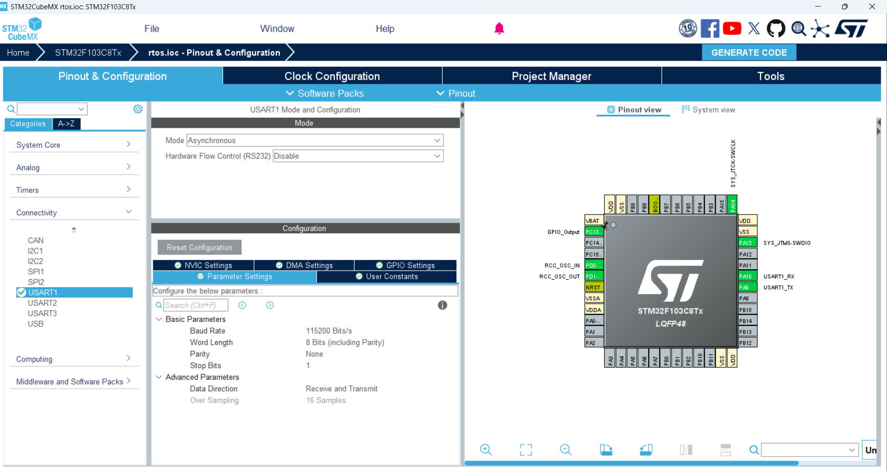
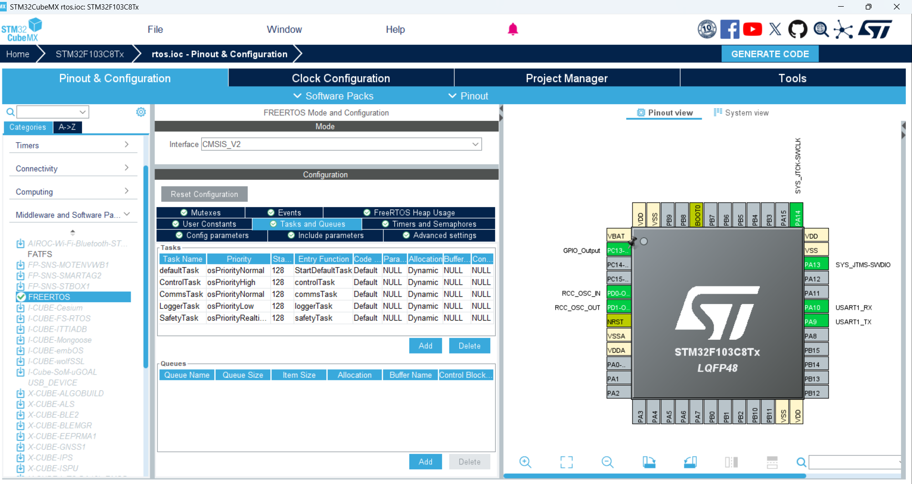
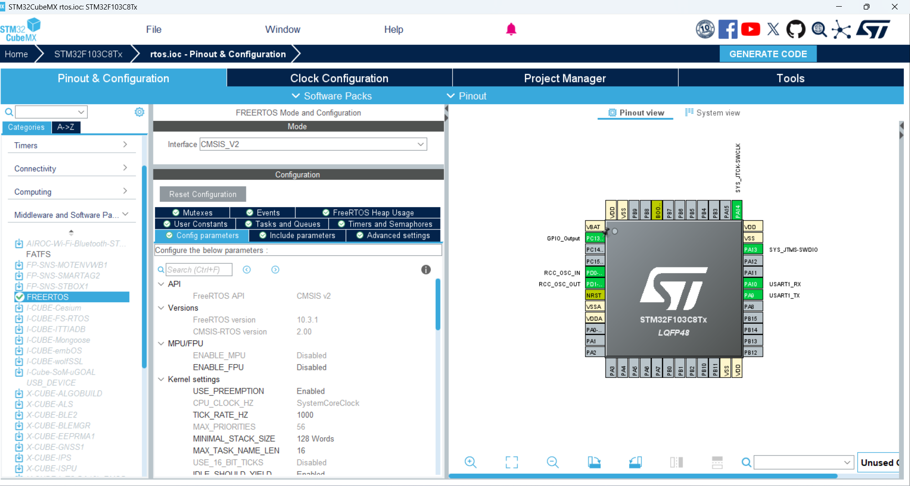
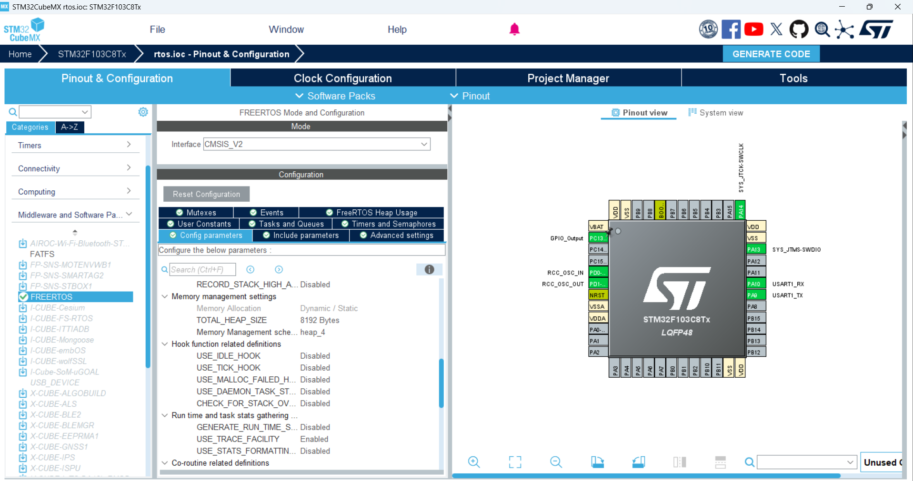
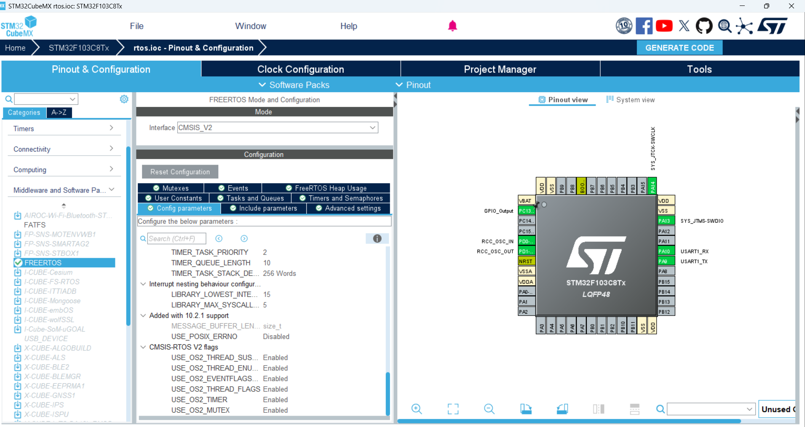
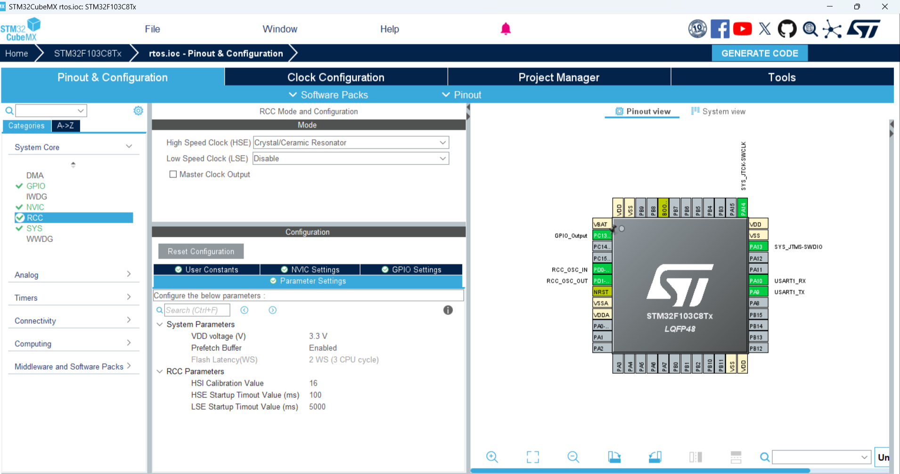

# FreeRTOS Demo on STM32F103C8T6

## Project Goals
- Demonstrate a multi-tasking architecture on the STM32F103C8T6 (Blue Pill) using FreeRTOS via the CMSIS-RTOS2 wrapper.
- Present a scientific engineering workflow: requirements analysis, task decomposition, scheduling strategy, and objective validation via a demo video.
- Provide synchronized collateral for documentation and education: this README, configuration screenshots in `img/`, and the detailed report in `documents/RTOS_Report_Styled.docx`.

## Why an RTOS?
| Technical Challenge | Root Cause | FreeRTOS Solution |
|--------------------|------------|-------------------|
| Deadline-driven multitasking | Safety, control, communications, and logging loops all run at a 1 s cadence | Preemptive priority scheduler ensures real-time tasks pre-empt background work.
| Deterministic UART logging | Serial log stream must remain evenly spaced | 1 kHz tick rate + `osDelay()` keep inter-message jitter within +/-1 tick.
| Future scalability | Additional sensors or control algorithms will appear later | FreeRTOS allows new tasks or synchronization primitives (queues/semaphores) without redesigning the main loop.
| System safety | Supervisory logic must fire even if other tasks misbehave | `SafetyTask` runs at `osPriorityRealtime`; watchdog logic can be added without starving it.

> **Engineering insight:** Priority partitioning makes timing analysis tractable: each task's response time is approximately execution time + sum of higher-priority interference. Current UART transmissions take ~1 ms, far below the 1000 ms period, guaranteeing ample margin.

## Software Architecture
### Configuration layer
- Clock: HSE 8 MHz x9 -> 72 MHz (`SystemClock_Config`), providing sufficient CPU bandwidth for a 1 kHz scheduler.
- FreeRTOSConfig: heap4 allocator, 1000 Hz tick, preemptive scheduling, priority levels spanning Low to Realtime.
- UART1: 115200 8N1 (`MX_USART1_UART_Init`) as the primary logging transport.

### Core tasks (`Core/Src/main.c`)
| Task | Priority | Stack (bytes) | Nominal period | Role and notes |
|------|----------|---------------|----------------|----------------|
| `SafetyTask` | Realtime | 512 | 1000 ms | Supervises system state, increments `countSafetyTask`, emits alerts; natural home for watchdogs and hazard sensors.
| `ControlTask` | High | 512 | 1000 ms | Hosts control-loop logic (PID, state machine); current demo logs `controlTask`.
| `CommsTask` | Normal | 512 | 1000 ms | Placeholder for fieldbus/protocol handling (Modbus, CAN, etc.); currently logs status.
| `LoggerTask` | Low | 512 | 1000 ms | Serializes aggregated logs; can evolve to SD logging or UART DMA streaming.
| `defaultTask` | Normal | 512 | 1 ms | Idle/background task; ideal spot to enter sleep modes and monitor heap usage.

### Synchronization & extension points
- Semaphores/mutex patterns are documented in the accompanying DOCX to help integrate shared peripherals safely.
- GPIO PC13 is configured as an output, ready to blink in the safety loop to expose timing visually.

## Visual Assets
### Configuration gallery (`img/`)
| Image | Commentary |
|-------|------------|
|  | PLL x9 topology yielding 72 MHz and bus distribution.
|  | UART1 115200 bps settings for deterministic logging.
|  | Relationship between tasks and their priority bands.
|  | CubeMX kernel configuration overview.
|  | Task attributes and stack sizing.
|  | Heap and tick configuration.
|  | Optional hook/trace settings.
|  | Pre-generation summary snapshot.
|  | Design notes captured during configuration.

### Demo video
- `video/demo.mp4` (01:45) shows flashing, run-time startup, and UART logs ticking every second.
- Viewing tip: 00:35-01:05 highlights that the scheduler maintains cadence even while interacting with the UART console.

## Hardware & Pinout
| Component | Notes |
|-----------|-------|
| STM32F103C8T6 (Blue Pill) | 72 MHz Cortex-M3, 64 KB Flash, 20 KB SRAM.
| ST-LINK V2 | SWD programming/debug.
| USB-UART (CP2102/FT232) | Serial log capture on the host PC.
| Stable 5 V / 3.3 V supply | Power budget that tolerates simultaneous ST-LINK + UART.

Pin mapping:
- PA9 -> USART1_TX -> host USB-UART RX.
- PA10 -> USART1_RX -> host USB-UART TX.
- PC13 -> status LED.
- GND -> common reference for every peripheral.

## Build & Flash Workflow
1. Launch Keil MDK-ARM 5.x -> `Project -> Open Project...` -> select `MDK-ARM/rtos.uvprojx`.
2. Pick the `rtos` build configuration and click **Build**.
3. Connect ST-LINK, click **Download** to flash.
4. Open a 115200 8N1 terminal to verify per-task logs.
5. For hardware tweaks, edit `rtos.ioc` in STM32CubeMX, regenerate code, then rebuild.

## Verification & Analysis
- **Jitter measurement:** Compare log timestamps in the video with the 1 s target; observed deviation < 2 ticks.
- **CPU load:** Instrument with `uxTaskGetSystemState()` (outlined in the DOCX) to ensure CPU usage stays below ~70% for future headroom.
- **Scalability tests:** Introduce a queue between `ControlTask` and `LoggerTask` to deliver sensor payloads without blocking UART calls.

## Repository Layout
- `Core/` - CubeMX-generated app sources/headers with task logic tweaks.
- `Drivers/` - STM32 HAL and CMSIS layers (see bundled LICENSE files).
- `Middlewares/Third_Party/FreeRTOS/` - FreeRTOS kernel and CMSIS-RTOS2 adapter.
- `MDK-ARM/` - Keil project files and debugger settings.
- `img/` - Screenshot gallery referenced above.
- `video/demo.mp4` - Runtime demonstration clip.
- `documents/RTOS_Report_Styled.docx` - Extended write-up on tasks, semaphores, mutexes, and test scenarios.

## References
- [FreeRTOS Kernel](https://www.freertos.org) - Scheduler theory and API reference.
- STMicroelectronics AN4435 - Real-time applications with STM32CubeMX & FreeRTOS.
- Internal report: `documents/RTOS_Report_Styled.docx`.

## License & Copyright
- Custom project code is released under the [MIT License](LICENSE).
- STMicroelectronics and FreeRTOS components retain their original licenses under `Drivers/` and `Middlewares/`.
- Copyright (c) 2025 Tran Dang Khoa. All rights reserved.

